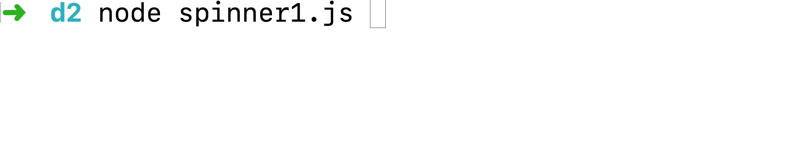

# Focals
Daily challenges from [Light House Labs Web Development Bootcamp](https://www.lighthouselabs.ca/web-bootcamp).

# [ISS Spotter](iss_spotter/)
An app for space enthusiasts who are interested in spotting the International Space Station (ISS). The space station is visible because it reflects sunlight. However, unlike the Moon, the space station isn't bright enough to be seen during the day. It can only be seen when it is dawn or dusk at your location. 

## [iss_spotter/index.js](iss_spotter/index.js)
Logs the result to `console.log` in a human-readable format.


## [iss_spotter/iss.js](iss_spotter/iss.js)
Orchestrates multiple API requests in order to determine the next 5 upcoming ISS fly overs for the user's current location.
* Input:
  * A callback with an error or results.
* Returns (via Callback):
  * An error, if any (nullable)
  * The fly-over times as an array (null if error):
    ```js
    [ { risetime: <number>, duration: <number> }, ... ]
    ```
  * Location used for the ISS info lookup:

## [iss_promiss.js](iss_spotter/iss_promiss.js) and [index2.js](iss_spotter/index2.js)
Simillar to [`iss.js`](iss.js) and [`index.js`](index.js) but implemented using `Promises`.

# [Cats as a Service](/json_the_cat)
## [index.js](/json_the_cat/index.js)
Processes `argv` input and passes cat-breeds to `breedFetcher.js` to obtain its description, and to prints a short description of the breed.
```bash
> node index Siberian Chartreux
# Upon a successful fetch, it may return:
:'

Siberian Info:
The Siberians dog like temperament and affection makes the ideal lap cat and will live quite happily indoors. Very agile and powerful, the Siberian cat can easily leap and reach high places, including the tops of refrigerators and even doors.

Chartreux Info:
The Chartreux is generally silent but communicative. Short play sessions, mixed with naps and meals are their perfect day. Whilst appreciating any attention you give them, they are not demanding, content instead to follow you around devotedly, sleep on your bed and snuggle with you if you’re not feeling well.
'
```
## [Breed Fetcher](/json_the_cat/breedFetcher.js)
Returns queried details about a cat breeds. Users can provide any breed name, causing the application to fetch the information from [`thecatapi.com`](https://thecatapi.com/).

```js
const fetchBreedDescription = require('./breedFetcher');
fetchBreedDescription('Siberian', callback);
// where possible callbacks:  callback(null, [STRING])
```

## [Testing](json_the_cat/test/breedFetcherTest.js)
To test the program run `npx mocha`

# Week 2
## [pizza.js](pizza.js)
A class with `getters` and `setters` to manipulate properties of a pizza.

## [Todo List](todo_list.js)
An command-line Todo List app, built to learn OOP.

## [fetcher.js](fetcher.js)
A small command line node app which takes a URL and a local file path, as command-line arguments, and downloads the resource to the specified path.
```bash
> node fetcher.js http://www.example.com/ ./index.html
Downloaded and saved 3261 bytes to ./index.html
```
## [requestExample.js](requestExample.js)
Uses `request` pacakge, installable via `npm install request`,  to fetch a page from `example.com`.

## [httpExample.js](httpExample.js)
Makes an example HTTP/1.1 request to example.com:80/ and logs the response.

## [Server](server.js) - [Client](client.js) model
`server.js` contains the bare minimum to start a server on port 8080. It accept multiple connections and send a welcome message to them.
`client.js` connects to server and sends greeting message.

## [survey.js](survey.js)
Simillar to a survey, asks a seriers of questions in a specific order, and generates a narrative paragraph.

Paragraph construct
```js
`${name} like to play ${sport}. Sometimes ${name} eats ${food} food, because ${name} likes that very much.
${name} is friend with ${someone}. They like to travel to ${vacationSpot}. In the past, ${name} visited ${placesVisited}.`
```
## [interactiveTimer.js](interactiveTimer.js)
Interactive timer behavior:
  * user can press `b` and it beeps right away
  * user can press `1` to `9` and 
    * `console.logs` "setting timer for `{x}` seconds..."        
    * beeps after `{x}` seconds passed
  * `ctrl + c` logs "Thanks for using", and terminates the program 


## [stdin.js](stdin.js)
Outputs `.` for each stdin character recieved.
On `ctrl + c` input, the program terminates.

## [timer](timer.js)
Based on the argv inputs, the timer `beeps` after a specified duration.
Example
`> node timer 7 8 12` would ring the system bell after 7, 8, and 12 seconds has passed

## [spinner](spinner.js)
animates a spinner on the console, (character |/-\|/-\| in that order), as though it is spinning




## [typewriter](typewriter.js)
Hello there from the other side of the monitor.

```bash
> node typewriter
Hello there from the other side of the monitor
# displayed 1 character at a time, 50 milliseconds apart.
```

## [hello_timeout](hello_timeout.js)

```bash
> node hello_timeout
4311o     # printed 1 seconds printed after the file is run
th3r3     # printed 2 seconds printed after the file is run
w0r1d     # printed 3 seconds printed after the file is run

```

# [Music Library](library.js)
## [Music Library with Methods](libraryWithMethods.js)
Same as `library.js` but uses *methods* to manage the library.


## [Music Library](library.js)
`library.js` is a program that manages music playlists using objects and arrays.
* *`printPlaylists`* :
  prints a list of all playlists, in the form:
  ```
  {playlist ID}: {playlist name} - {#} tracks
  p01: Coding Music - 2 tracks
  ```

* *`printTracks`* : 
Prints a list of all tracks, using the following format
  ```
  {trackID}: {track name} by {artist} ({album})
  t01: Code Monkey by Jonathan Coulton (Thing a Week Three)
  ```

* *`printTrack`* : 
Simillar to printTracks, but prints info on a single

* *`printPlaylist`* : 
Prints a list of tracks for a given playlist, using the following format:

  ```js
  printPlaylist('p01')
  // p01: Coding Music - 2 tracks
  // t01: Code Monkey by Jonathan Coulton (Thing a Week Three)
  // t02: Model View Controller by James Dempsey (WWDC 2003)
  ```
* *`addTrackToPlaylist`* : 
Adds an existing track to an existing playlist

* *`addTrack`* : 
Adds a track to the library

* *`addPlaylist`* : 
Adds a playlist to the library

* *`printSearchResults`* : 
Given a query string string, prints a list of tracks where the name, artist or album contains the query string (case insensitive)


# Week 1
## [sum.js](sum.js)
This file sums the input argumets
```bash
> node sum 1 2
3

> node sum 100 20 30 50
200
```

## [lunch.js](lunch.js)
A function such that it takes 2 input and prints a suggestion. (Boolean representing state of hunger, & number representing time in minutes to spare)

Output:
```
  I'm hungry and I have 20 minutes for lunch.
  Try to eat at a nearby food store
  ---
  I'm hungry and I have 50 minutes for lunch.
  You are in the bootcamp, are you sure you got more than 30 minute?!
  ---
  I'm not hungry and I have 30 minutes for lunch.
  Go back to work!
  ---
  I'm hungry and I have 15 minutes for lunch.
  Pick something up and eat in the lab
```

## [stringReverser.js](stringReverser.js)
Reverses the order of characters in a string. String are pssed via `bash` argv arguments.
 ```bash
> node reverse.js hello goodbye
olleh
eybdoog
```

## [pig-latin.js](pig-latin.js)
Converts each input argument srings to pig latin (using simplified rules), then puts the translated words together into one sentence, and logges it to the console.

```bash
> node pig-latin Hi my name is John
ihay mymyay amenay isyay ohnjay
```

```bash
> node pig-latin this is all just gibberish
isthay isyay allyay ustjay ibberishgay
```
## concepts.js
Joins an array of strings.

Given
```javascript
const conceptList = ["gists", "types", "operators", "iteration", "problem solving"];
console.log(conceptList);
```
```bash
> node concepts
Today I learned about gists, types, operators, iteration, problem solving.
```

## [password.js](password.js)
Takes a command line argument (a password) and obfuscates it by following a few rules.
* Obfuscation Rules
    * Every "a" in the string should be replaced with a "4".
    * Every "e" in the string should be replaced with a "3".
    * Every "o" (oh) in the string should be replaced with a "0" (zero).
    * Every "l" (el) in the string should be replaced with a "1" (one).

```bash 
> node password.js password
p4ssw0rd

> node password.js abracadabra
4br4c4d4br4

> node password.js audaciously
4ud4ci0us1y
```

## [dice-roller.js](dice-roller.js)
Takes a single parameter (a number) from the command line and rolls that many six-sided dice. 

Example:
```bash
> node dice-roller 3
Rolled 3 dice: 2, 6, 5

> node dice-roller 5 10
Rolled 5 dice: 6, 5, 5, 1, 1
Rolled 10 dice: 6, 2, 6, 1, 2, 5, 4, 5, 1, 4
```
## [average.js](average.js)
Averages a given array of numbers.


## [reverse.js](reverse.js)
Reverse the characters of words passed via command line arguments.

```bash
> node reverse Hi there. How are you?
iH .ereht woH era ?uoy

> node reverse I am good. Thank you for asking.
I ma .doog knahT uoy rof .gniksa
```

## [isPalindrome.js](isPalindrome.js)
Checks if a string or sentence a palindrome.

Examples:
```bash
> node isPalindrome "a santa at NASA"
true

> node isPalindrome "racecar"
true

> node isPalindrome "foo"
false
```
## [sumRecursively.js](sumRecursively.js)
Sums 1 to n recursively.
```js
// Example
sumRecursively(4);
// Returns: 10
```

## [printNestedArrays.js](printNestedArrays.js)
Prints the content of a nested array.

```js
const myArray = [1, [[[[[2]]]]], 3, [4, 5, [6, [7]], 8, 9], 10];
printNestedArrays(myArray);
/* Returns
1
2
3
4
5
6
7
8
9
10
*/
```

## [sumRecursivelyFromTo](sumRecursivelyFromTo.js)
Sums `fromN` to `toN` recursively. Includes the end points. Assumes integer inputes, with fromN smaller than toN.
```js
// Example
sumRecursivelyFromTo(3, 7);
// Returns: 25

```
## [sumArray.js](sumArray.js)
Sums all the numbers in a nested array, recursively.

|            `Input`            | `Output` |
|:---------------------------:|:------:|
| `[1, 2, 3, 4, 5]`             |   15   |
| `[[1, 2, [[3], 4]], 5, []]`   |   15   |
| `[[[[[[[[[[[[[1]]]]]]]]]]]]]` |    1   |
